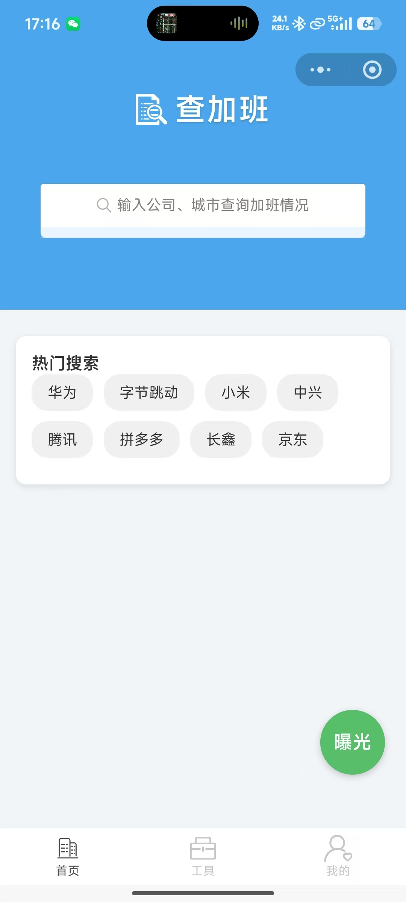

# 查加班助手（job-overtime-helper） 

**查加班助手** 是一款面向职场人的微信小程序，主打公司加班信息查询、用户真实职场曝光，搭配多功能职场工具库，帮助用户打破职场信息差，精准避坑求职、上班难题，为职场决策提供靠谱参考。

## 💡 项目简介

在求职和职场工作中，加班情况、工作强度、薪资补贴、调休政策是大家最关心的核心信息，但目前行业内相关信息极度不透明，虚假招聘、隐性加班、无偿加班等问题屡见不鲜。

**查加班助手** 依托用户真实曝光分享，搭建公开、透明的企业加班信息库，让每一位用户都能自由查询、主动分享，打破职场信息差。同时配套多款实用职场计算工具，一站式解决职场薪资、补偿核算需求，打造轻量化、高实用的职场辅助工具。

## ✨ 核心亮点功能

### 1\. 加班查询 \& 职场曝光

- **真实加班查询**：支持快速搜索企业信息，直观查看各家公司作息时间、加班时长、调休政策、工作强度、薪资补贴等真实职场数据，求职择业精准避坑。

- **用户自主曝光**：用户可自主发布、分享真实的公司加班与职场情况，完善平台数据，帮助更多职场人规避隐性加班、职场乱象等问题。

- **人性化使用体验**：搭配热门搜索、新用户引导、简洁列表展示等功能，操作简单，上手零门槛。

### 2\. 全能职场工具库

内置多款高频刚需职场工具，无需跳转第三方平台，一站式解决职场核算、权益查询问题，实用便捷，提升用户使用粘性：

- **时薪换算器**：快速精准核算个人时薪、加班时薪，清晰掌握劳动报酬性价比。

- **加班费计算器**：适配工作日、周末、法定节假日，自动核算对应加班薪资。

- **离职补偿金速查**：快速查询、核算离职补偿标准，助力维护个人职场合法权益。

## 📸 首页预览

## 📱 小程序使用方式

#### 方式一：微信小程序直达链接

微信内打开链接即可直接访问：`#小程序://查加班助手/GOAIpo1xMPexEwr`

#### 方式二：扫码访问

扫描下方小程序码快速进入：

## 🤝 问题反馈 \& 交流

如果你在使用过程中遇到 Bug、功能建议、工具需求、数据优化建议，欢迎通过以下方式反馈：

- 可在项目留言区反馈 Bug、提出功能优化建议、新增工具需求等，作者会持续跟进迭代优化

## 📄 免责声明

本项目仅为信息展示与工具服务平台，平台所有加班信息均由用户自主发布，仅作职场参考使用。用户需对自身发布信息的真实性、合法性负责，平台不承担因信息不实、信息争议产生的任何法律责任。请勿利用本平台信息进行虚假宣传、恶意诋毁等违规操作。

## ⭐ 支持项目

如果本小程序对你求职、职场工作有所帮助，欢迎多多支持、分享给身边职场人！

